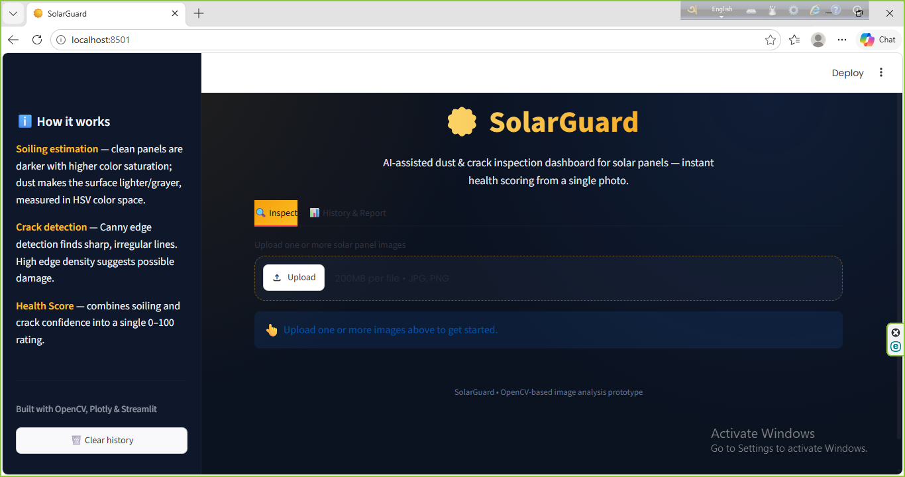
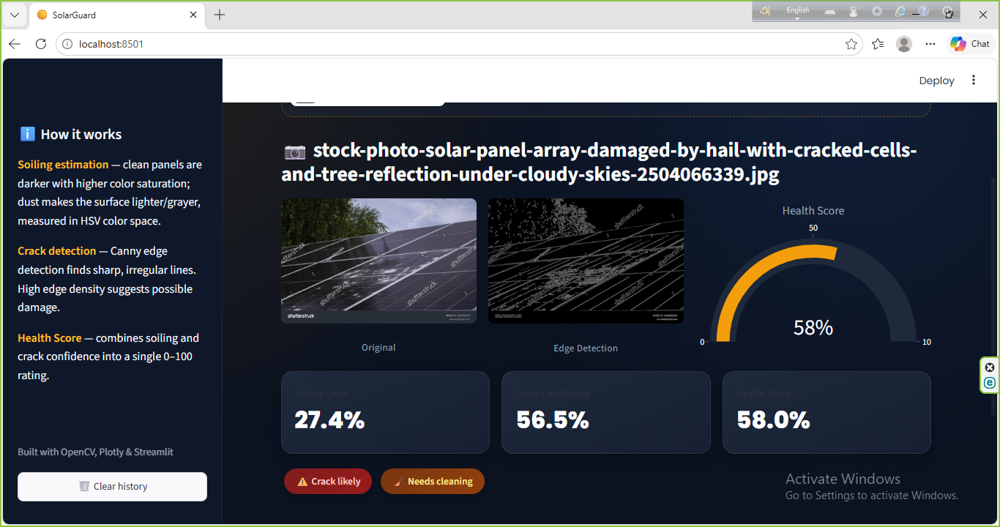

# ☀️ SolarGuard — Solar Panel Dust & Crack Checker

A computer-vision dashboard that inspects solar panel images and instantly reports:

- **Soiling level (%)** — how much dust is likely covering the panel, estimated using HSV color-space analysis
- **Crack detection** — flags panels that may have surface cracks, using Canny edge-density analysis
- **Health Score** — a single 0–100 gauge combining soiling and crack confidence
- **Session history** — track every image checked in one run
- **PDF report export** — download a summary of all checked panels

Built with **Python, OpenCV, Plotly, and Streamlit** — no pretrained ML model needed, so it installs and runs in minutes.

## 🖼️ Screenshots

**Dashboard home**



**Inspection result — health gauge, soiling %, crack confidence**



## ⚙️ How It Works

| Step | Technique |
|------|-----------|
| Soiling estimation | HSV saturation/brightness analysis — dustier surfaces are lighter and less saturated |
| Crack detection | Canny edge detection — high edge density suggests irregular surface damage |
| Health Score | Weighted combination of soiling % and crack confidence, shown as a gauge |
| Report generation | fpdf2 — compiles session results into a downloadable PDF |

## 🚀 Getting Started

```bash
git clone https://github.com/raisulislam0516/solarguard.git
cd solarguard
pip install -r requirements.txt
streamlit run app.py
```

Then open `http://localhost:8501` in your browser.

## 📁 Project Structure

```
solarguard/
├── app.py                  # Main Streamlit dashboard
├── requirements.txt        # Python dependencies
├── dashboard-home.png      # App screenshot
├── inspection-result.png   # App screenshot
└── README.md
```

## 📄 License

MIT — free to use and modify.
